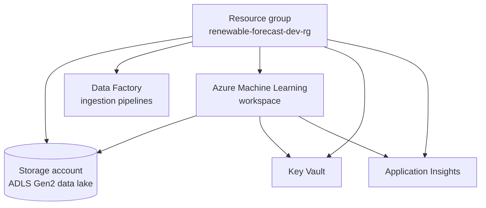

# Renewable Forecast – Azure Infrastructure and MLOps Monitoring

Infrastructure as code for a renewable-energy forecasting project (December 2025 – January 2026). It has
two parts:

1. **Terraform (Azure):** the cloud foundation for data and ML.
2. **Docker Compose (local):** experiment tracking and model monitoring with MLflow, Prometheus and
   Grafana.

It is the infrastructure counterpart of the
[Kubernetes forecast service](https://github.com/alireza-mollaalihosseini/k8s).

## Azure resources



| File | Contents |
|---|---|
| `provider.tf` | Terraform ≥ 1.5, `azurerm` provider ~> 3.0 |
| `main.tf` | resource group, storage account with hierarchical namespace (ADLS Gen2), Data Factory, Azure ML workspace (optional system-assigned identity), Application Insights, Key Vault |
| `variables.tf` | `project_name`, `location` (default `westeurope`), `environment`, storage tier/replication, `enable_system_identity`, common `tags` |
| `outputs.tf` | names and IDs of the created resources |

```bash
az login
terraform init
terraform plan
terraform apply      # terraform destroy to tear down
```

Storage account, Key Vault and Data Factory names must be globally unique in Azure, so change
`project_name` or the fixed names in `main.tf` if `apply` reports a naming conflict.

## Monitoring stack

| Service | Port | Role |
|---|---|---|
| MLflow | 5000 | experiment tracking and model registry (SQLite backend, local artifact store) |
| Prometheus | 9090 | scrapes MLflow and the custom model-metrics exporter (`prometheus.yml`) |
| Grafana | 3000 | dashboards on top of Prometheus |
| `model_metrics_exporter.py` | 8000 | exposes `model_latest_rmse` and `drift_latest_p_value` gauges |

```bash
docker compose up -d
pip install prometheus-client
python model_metrics_exporter.py
```

Then add Prometheus (`http://prometheus:9090`) as a data source in Grafana. The Grafana admin password
in `docker-compose.yml` is a local default, so change it after the first login.

The exporter currently publishes simulated values. It is the placeholder for querying the latest run
metrics and a drift test from MLflow.
